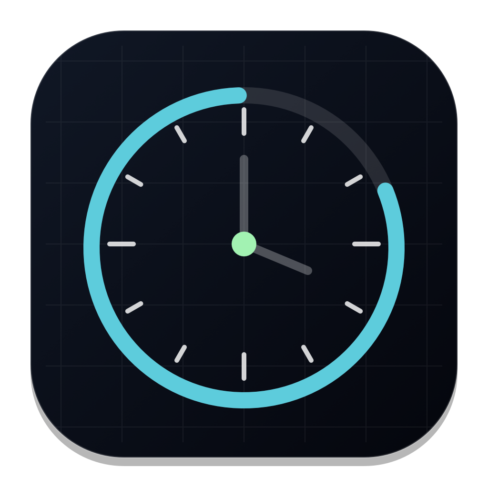

<p align="center">
  
</p>

<h1 align="center">Codex Quota Menubar</h1>

<p align="center">
  A tiny macOS menu bar app for watching your current Codex / ChatGPT quota at a glance.
</p>

<p align="center">
  <a href="#中文">中文</a> ·
  <a href="#english">English</a> ·
  <a href="https://github.com/jieyangxchen/codex-quota-menubar/releases/latest">Download</a>
</p>

---

## 中文

Codex Quota Menubar 是一个轻量 macOS 菜单栏工具，用来显示当前 Codex / ChatGPT 统一额度剩余情况。它会优先读取 ChatGPT 内置 Codex app-server 的实时账户级用量；如果实时数据暂时不可用，再降级读取本机 Codex 会话日志中的最近一次用量状态。

### 主要特性

| 功能 | 说明 |
| --- | --- |
| 菜单栏双行显示 | 上排显示实际 quota 窗口，下排显示各自剩余额度百分比 |
| 适配新版 ChatGPT | 优先使用 `/Applications/ChatGPT.app/Contents/Resources/codex`，兼容旧 Codex.app 路径 |
| 实时优先 | 复用本机 Codex app-server 连接读取账户级 `account/rateLimits/read` |
| 日志降级 | 实时读取失败时，尾读 `~/.codex/sessions/**/*.jsonl` 中最近的 `token_count` |
| 本地缓存 | 启动时可先显示上一次成功 live 快照，避免短暂不可用时跳回空值 |
| 数字稳定 | 刷新时保留旧数字直到新数字返回，百分比使用固定槽位避免跳动 |
| 展示切换 | 可切换显示已用百分比或剩余百分比 |
| Token 总量 | 可选择在菜单中显示当前线程 total tokens |
| 诊断信息 | 菜单内提供 source、更新时间、live 进程状态、读取次数和缓存路径 |
| 一键操作 | 菜单内提供 Refresh、Open ChatGPT、Quit |

### 菜单栏效果

```text
1w
83%
```

实际显示为紧凑的动态列布局：当前新版返回单个 1 周窗口时只显示 `1w`；如果旧日志或旧服务仍返回多个窗口，也会按实际窗口分别显示。百分比使用固定槽位，`89% -> 80%` 这类变化不会让整列左右抖动。

### 安装

从 [Releases](https://github.com/jieyangxchen/codex-quota-menubar/releases/latest) 下载：

- `CodexQuotaMenubar-macOS.dmg`
- 或 `CodexQuotaMenubar-macOS.zip`

打开后将 `CodexQuotaMenubar.app` 放到 `/Applications`，再启动即可。当前版本未签名，首次启动时 macOS 可能需要在 System Settings 里手动允许。

### 数据来源

应用的数据链路按优先级分为三层：

1. **Live**

   通过本机 ChatGPT 内置 Codex app-server 调用，并在后台复用同一个 stdio 连接：

   ```text
   account/rateLimits/read
   ```

   应用读取账户级 `codex` aggregate 桶里的实际窗口。新版 ChatGPT / Codex 目前返回单个 1 周窗口，旧版响应中的 5 小时窗口会继续被兼容显示。

2. **Log fallback**

   当 live 读取失败时，应用读取最近的本机会话日志：

   ```text
   ~/.codex/sessions/**/*.jsonl
   ```

   它只解析其中的 `token_count` 事件，不上传、不修改日志文件。默认仅读取候选文件尾部，必要时对少量最近文件做全量回退。

3. **Last-good live cache**

   当 live 和 log 都暂时不可用时，应用可使用本机 Application Support 里的最后一次成功 live 快照兜底。缓存只保存 quota 数值，不保存账号 token。

### 刷新策略

- 默认每 8 秒自动刷新一次
- 打开菜单时，如果当前数据已超过 3 秒，也会触发一次后台刷新
- 菜单中的 Refresh Now 可立即刷新
- 刷新中不会显示 `...`，而是保留旧数字直到新数据返回
- 若 live 不可用，会在菜单里显示当前 source 为 `Log` 或 `Cached Live`
- Diagnostics 子菜单可查看 live 进程、成功读取次数、最近错误和缓存路径

### 本地开发

运行菜单栏 app：

```bash
swift run codex-quota-menubar
```

运行核心测试：

```bash
swift run codex-quota-core-tests
```

构建 `.app`：

```bash
scripts/build-app.sh
```

构建结果：

```text
dist/CodexQuotaMenubar.app
```

构建并安装到稳定的本地路径，同时设置开机自启动：

```bash
scripts/install-local.sh
```

默认安装位置：

```text
~/Applications/CodexQuotaMenubar.app
```

### 本地打包

生成 `.dmg`、`.zip` 和 checksum：

```bash
scripts/package-release.sh
```

构建产物会输出到：

```text
release/
```

### 发布

推送 `v*` tag 会触发 GitHub Actions Release workflow：

```bash
git tag v0.3.0
git push origin v0.3.0
```

Workflow 会在 macOS runner 上完成：

1. 生成 app icon
2. 运行核心测试
3. 构建 `CodexQuotaMenubar.app`
4. 打包 `.dmg` / `.zip`
5. 上传到 GitHub Release

### 隐私与仓库卫生

仓库不会包含：

- 本机 `.build/` 缓存
- 本地 `dist/` / `release/` 产物
- Codex 本机会话日志
- 本机绝对路径
- 个人 token、API key、cookie、session state

Release 安装包由 GitHub Actions 从源码重新构建。

---

## English

Codex Quota Menubar is a small macOS menu bar utility for monitoring your remaining Codex / ChatGPT quota. It prefers live account-level quota from the Codex app-server bundled with ChatGPT and falls back to the newest local Codex session log when live data is unavailable.

### Highlights

| Feature | Details |
| --- | --- |
| Two-line menu bar display | Shows actual quota windows on top and remaining percentages below |
| Updated ChatGPT support | Prefers `/Applications/ChatGPT.app/Contents/Resources/codex` and keeps legacy Codex.app fallback |
| Live-first data | Reuses a local Codex app-server connection for `account/rateLimits/read` |
| Local log fallback | Falls back to the newest `token_count` event by tail-reading local Codex logs |
| Last-good cache | Restores the last successful live snapshot on startup or temporary failures |
| Stable digits | Keeps old values during refresh and uses fixed-width percentage slots |
| Display modes | Toggle used percentage versus remaining percentage |
| Token total | Optionally show total token usage in the menu |
| Diagnostics | Shows source, update time, live process state, read counts, and cache path |
| Quick actions | Refresh, Open ChatGPT, and Quit from the menu |

### Menu Bar Shape

```text
1w
83%
```

The menu bar item uses a compact dynamic-column layout. With the current ChatGPT response it shows only the 1-week window; if legacy logs or services still return multiple windows, each window is displayed separately. Percentage values are drawn in stable slots so updates like `89% -> 80%` do not cause the whole column to shift.

### Installation

Download from [Releases](https://github.com/jieyangxchen/codex-quota-menubar/releases/latest):

- `CodexQuotaMenubar-macOS.dmg`
- or `CodexQuotaMenubar-macOS.zip`

Move `CodexQuotaMenubar.app` into `/Applications` and launch it. The app is currently unsigned, so macOS Gatekeeper may require manual approval on first launch.

### Data Sources

The app uses a three-layer data flow:

1. **Live**

   It calls the Codex app-server bundled with ChatGPT and reuses one background stdio connection:

   ```text
   account/rateLimits/read
   ```

   The app reads the actual windows in the account-level `codex` aggregate bucket. Current ChatGPT / Codex responses return a single 1-week window; legacy 5-hour windows are still displayed when present.

2. **Log fallback**

   If live quota is unavailable, the app reads the newest local Codex session log:

   ```text
   ~/.codex/sessions/**/*.jsonl
   ```

   It only parses `token_count` events. It does not upload or modify local logs. By default it reads candidate file tails and only full-reads a small fallback set when tails miss quota data.

3. **Last-good live cache**

   If both live and log data are temporarily unavailable, the app can show the last successful live snapshot from local Application Support storage. The cache stores quota values only, not account tokens.

### Refresh Behavior

- Auto-refreshes every 8 seconds
- Opening the menu triggers a background refresh when the current data is more than 3 seconds old
- Refresh Now triggers an immediate refresh
- Existing values stay visible while a refresh is running
- The menu shows `Log` or `Cached Live` as the source when fallback data is used
- The Diagnostics submenu shows live process state, successful read count, recent errors, and cache path

### Local Development

Run the app:

```bash
swift run codex-quota-menubar
```

Run tests:

```bash
swift run codex-quota-core-tests
```

Build the `.app` bundle:

```bash
scripts/build-app.sh
```

Output:

```text
dist/CodexQuotaMenubar.app
```

Build, install to a stable local path, and configure launch-at-login:

```bash
scripts/install-local.sh
```

Default install location:

```text
~/Applications/CodexQuotaMenubar.app
```

### Local Packaging

Create a `.dmg`, `.zip`, and checksum file:

```bash
scripts/package-release.sh
```

Artifacts are written to:

```text
release/
```

### Release

GitHub Actions builds release assets when a `v*` tag is pushed:

```bash
git tag v0.3.0
git push origin v0.3.0
```

The workflow runs on macOS and:

1. Generates the app icon
2. Runs the core test runner
3. Builds `CodexQuotaMenubar.app`
4. Packages `.dmg` / `.zip`
5. Uploads assets to GitHub Release

### Privacy and Repository Hygiene

The repository excludes:

- Local `.build/` cache
- Local `dist/` / `release/` artifacts
- Local Codex session logs
- Machine-specific absolute paths
- Personal tokens, API keys, cookies, or session state

Release artifacts are rebuilt from tracked source files in GitHub Actions.
